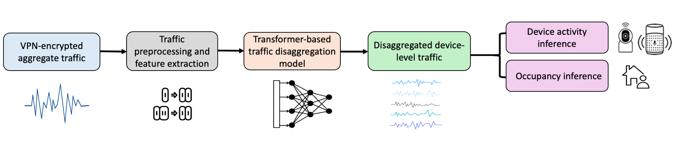
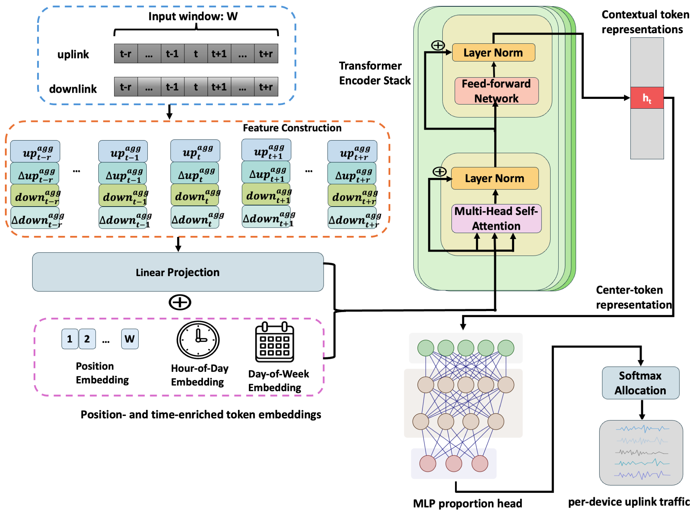

# Inferring Device-Level Activity from VPN-Encrypted Smart-Home Traffic

This repository contains the implementation of our paper on IoT traffic disaggregation.

## Abstract

The growing adoption of Internet of Things (IoT)
devices has led to their widespread deployment in smart homes,
where they improve convenience and support automation. How-
ever, these devices continuously communicate with cloud services
and mobile applications, generating network traffic that can
reveal device usage, user routines, and occupancy patterns. Even
when packet contents are encrypted, observable traffic charac-
teristics such as timing, direction, and volume may still leak
privacy-sensitive information. To further reduce such leakage,
users often route smart-home traffic through virtual private
networks (VPNs), which encrypt traffic contents and merge
communications from multiple devices into aggregated encrypted
traffic. Prior work has shown that VPN tunneling alone is
insufficient to fully protect smart-home privacy. However, the
extent to which device-level activity can still be inferred from
VPN-encrypted traffic remains underexplored.
In this paper, we investigate whether device-level activity
can be inferred from VPN-encrypted smart-home traffic. We
propose a Transformer-based traffic disaggregation framework
that learns device-aware temporal representations and captures
long-range dependencies to recover per-device traffic traces from
encrypted aggregates. We evaluate the proposed method on data
collected from three real-world smart homes and show that it
can accurately infer device-level activity patterns from VPN-
encrypted traffic. We further show that devices with weak and
intermittent traffic patterns may still expose sensitive informa-
tion, even when their traffic can only be partially recovered. Our
method achieves a MAPE of 9.75% and an MCC of 0.903 on
these challenging devices, showing that their activity can still
be inferred from VPN-encrypted traffic. These results show that
VPN protection alone does not eliminate the risk of device-level
activity inference in smart homes.

## Pipeline

The overall pipeline of our method is shown below. Starting from aggregated encrypted smart home traffic, we first extract temporal traffic features and organize them into fixed time bins. The processed sequence is then fed into the disaggregation model to recover per device traffic traces, which can further support device activity inference and occupancy inference.

<p align="center">
  
</p>

## Framework

Our architecture takes aggregated traffic features and auxiliary temporal information as input, and learns device aware representations for traffic allocation and reconstruction. By combining temporal context modeling with device specific priors, the model produces per device traffic predictions from the mixed encrypted traffic stream.

<p align="center">
  
</p>

## Data

We used datasets from: 
[Dataset 1](https://iotanalytics.unsw.edu.au/iottraces.html)
[Dataset 2](https://datadryad.org/dataset/doi:10.5061/dryad.w0vt4b94b)
and a Real-Home VPN Dataset.

## Repository Structure

```text
src/        core model and utility code
scripts/    training and evaluation scripts
